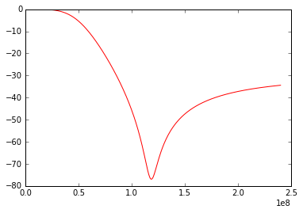
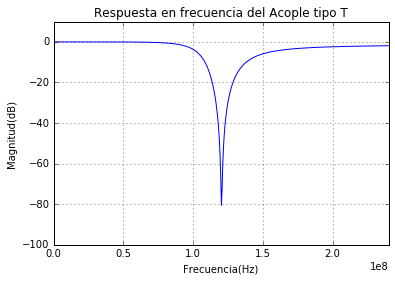

## INFORME N°2 - DISEÑO DE CIRCUITOS RESONANTES CON ACOPLES TIPO L-T-PI.

### AUTOR:

- Diego Javier Mena Amado Cod. 20092005053  

#### RESUMEN

<p style="text-align: justify;">En esta práctica se realiza el diseño e implementación de acoples tipo L,T y Pi para circuitos de RF (150Mhz), comprobaremos la necesidad de emplear componentes para altas frecuencias dado que los dispositivos comunes se comportan de manera no satisfactoria.</p>

<p style="text-align: justify;">El diseño de los 3 acoples se realizo haciendo uso de la carta de Smith; dadas las consideraciones a posibles soluciones, se procede a simular cada acople con Multisim y se inicia con la deteccion de los elementos a emplear.</p> 

<p style="text-align: justify;">Gracias al analizador de espectros VNA, se realizan reiteradas mediciones de condensadores, bobinas y cargas con el objetivo de emplear en el montaje los valores identicos a los diseñados.</p>

<p style="text-align: justify;">Idealmente se pensaba en usar una carga con impedancia de  75$\Omega$ a la salida, pero para nuestro caso, la carga no era pura, se notaba la inclusion de reactancias capacitivas o inductivas, por tal razon fue necesario medirla en primera instancia y asi realizar nuevamente los calculos con la mayor precision posible, esta carga real tuvo el valor de 72.938 $\Omega$ + j157.65 pF.</p>

$$Figura \ 1: \ Valor \ de \ la \ carga $$


#### INTRODUCCIÓN

<p style="text-align: justify;">Los sistemas de comunicaciones de radiofrecuencia están compuestos por circuitos o redes eléctricas que se interconectan. Dicha interconexión requiere de máxima transferencia de potencia, pero en los casos en que ésta no se cumple, se hace necesario incluir un circuito intermedio denominado acoplador.  

El acople consiste en emparejar las impedancias de dos o más redes, usando el efecto de resonancia. Durante la práctica se podrá evidenciar las pérdidas que generan los conductores en radio frecuencia, ya que la mayoría presenta efectos inductivos o capactivos muy altos que afectan el diseño, se tuvo en cuenta un margen de error de los elementos del 10% para así contrarrestar capacitancias o inductancias parásitas que se puedan presentar en la soldadura, los caminos de cobre y los convertidores requeridos en el circuito.</p>

### Caracteristicas de las diferentes redes de acople:

#### ACOPLE TIPO L
<p style="text-align: justify;">Una de las formas más simples de una red de acoplamiento de impedancias es la red tipo L, la cual consta de un inductor y un capacitor conectados en configuraciones formando una L . Mediante el diseño adecuado de la red de acoplamiento, se garantiza que la impedancia de carga en este caso es 72.938$\Omega$ + j157.65pF puede acoplarse a la impedancia del VNA que es de 50 $\Omega$.</p>


$$Figura \ 2: \ Acople \ tipo \ L$$


#### ACOPLE TIPO PI
<p style="text-align: justify;">Aunque las redes de acoplamiento tipo L se usan con frecuencia para el acoplamiento de impedancias, estas no son flexibles en cuanto a su selectividad. Cuando se diseñan redes L, hay muy poco control sobre el Q del circuito. Este valor está definido por las impedancias interna y de carga. Se obtiene, desde luego, un valor de Q, pero quizá no siempre sea el necesario para lograr la selectividad deseada por lo que se recurre a un acomplaimento tipo PI.</p>
 

$$Figura \ 3: \ Acople \ tipo \ PI$$

<p style="text-align: justify;">Este tipo de configuración, también se la denomina “back to back”, que es el acople entre dos redes tipo L, una en configuración invertida con la otra. De esta manera se consigue adaptar las resistencias de carga y de fuente a una cierta impedancia o resistencia virtual entre ellas.</p>

#### ACOPLE TIPO T
<p style="text-align: justify;">Para este tipo de configuración se siguen las misma reglas de diseño que para con la configuración PI, con la excepción que la adaptación de impedancias entre la entrada y la salida se hace con dos redes L a través de una unión virtual de alta impedancia, es decir, se adapta a través de una resistencia virtual Rv que debe ser mayor que las impedancias Rs y RL. Esto significa que las dos redes tipo L se conectarán en paralelo por la rama conectada a tierra tal como se observa en la figura.</p>


$$Figura \ 4: \ Acople \ tipo \ T$$


### OBJETIVOS
GENERAL: Diseñar redes de acople tipo L, PI y T que garanticen la máxima transferencia de potencia.

ESPECIFICOS:
* Analizar el comportamiento de cada red de acople con respecto a la frecuencia de forma teórica, simulada y práctica.
* Comprobar que los valores teoricos concuerdan con los valores mostrados en el VNA.

### METODOLOGIA
Una vez planteado el problema de diseño para cada red de acople a una frecuencia de  150Mhz, empezamos a iterar en la forma de hallar la solución de la manera mas acertada posible.

La carga empleada que inicialmente se pensaba tenia 75$\Omega$ resulto tener segun el VNA 72.938$\Omega$ + j157.65pF 

De manera colectiva por el grupo de analisis, se determina recurrir a la carta de smith para encontrar los valores de las dispositivos a emplear en la construcción de los acoples.

Se procede a ubicar los puntos de carga y generador normalizados en la carta Smith como se observa en la figura:

Para el diseño del acople tipo L, se debe consideran dos soluciones: bobina en serie y condensador en paralelo (Pasa-bajos) ó condensador en serie y bobina en paralelo (Pasa-altos) como se muestra en la figura:


$$Figura \ 5: \ Solución \ Filtro \ Tipo  \ L $$

Como se aprecia en la figura, hemos obtado por el diseño pasa-bajos, encontrando el punto correspondiente a 0.27imos y las distancias entre los puntos, para luego emplear las sigueintes ecuaciones que nos arrojan los valore practicos a emplear en el montaje.

$$ C=\frac{C_n}{2*\pi*f_c*R}  $$  
$$ L=\frac{R*L_n}{2*\pi*f_c}  $$  

El procedimiento para hallar los valores de los componentes de las redes de acople tipo PI y T se realizan de una manera similar, mas en este documento ese expondra con enfasis el acople tipo L.

### SIMULACIONES

$$Figura \ 6: \ Simulación \ Tipo \ L$$


$$Figura \ 7: \ Diagrama de Bode \ Tipo \ L$$


### CONCLUSIONES
<p style="text-align: justify;">Se concluye que la utilización de elementos pasivos para la construcción de filtros presenta una fuerte aplicación en la adaptación de impedancias en circuitos que requieran una máxima transferencia de potencia como por ejemplo el acople de una antena a un amplificador. Al involucrar elementos almacenadores de energía como los capacitores e inductores en el diseño de redes de acople, inevitablemente habrá una ganancia de voltaje; ganancia que dependerá decada red diseñada, para algunos casos amplificará la señal y para otros la mantendrá intacta. El factor Q de las redes de acople Pi y T tiene una relación directa con el inductor utilizado, en donde existe más facilidad de elección del factor Q para la ejecución de alguna aplicación específica que lo requiera. Se hace evidente que dicha característica existe, a través de los análisis realizados en donde estas dos redes son las que mayor factor de calidad presentan. Finalmente se concluye que la máxima transferencia de potencia a la carga ocurrirá cuando se trabaje en la frecuencia de resonancia según la red adaptación que se emplee; si se requiere algún valor del factor de calidad específico no es adecuado trabajar con la red de acople L, puesto que dicha red no ofrece esa facilidad, si lo que se pretende es solamente acoplar impedancias cualquier red de adaptación puede ser utilizada.</p>

### REFERENCIAS
* Notas tomadas en clases de teoria y laboratorio [Universidad Distrital Francisco José de Caldas]

### ANEXOS


```python
#RED DE ACOPLE TIPO L
%matplotlib inline
import numpy as np
from matplotlib import pyplot as mp
from IPython.html.widgets import interact

def pintar(f,P):
    mp.plot(f,P,"b", label="P")
    mp.legend( loc=4)
    
f=np.linspace(1000,240e6,num=500)#Frecuencia
Zg=50
Xc=1/(2*np.pi*f*38.7577e-12)
Xl=2*np.pi*f*106.5633e-9
Zl=72.938-16j 
Zi=(-Xc*1j)+((1j*Xl*Zl)/(Zl+(1j*Xl)))
ρ=(Zi-Zg)/(Zi+Zg)
P=10*np.log(np.abs(ρ)**2)
mp.plot(f,P,color='red')
plt.title("Respuesta en frecuencia del Acople tipo L")
plt.ylabel("Magnitud(dB)")   
plt.xlabel("Frecuencia(Hz)")  
plt.ylim(-80,20)
plt.xlim(0,240e6)
plt.grid(True)
```


    ---------------------------------------------------------------------------

    NameError                                 Traceback (most recent call last)

    <ipython-input-8-1588e74c46b1> in <module>()
         18 P=10*np.log(np.abs(ρ)**2)
         19 mp.plot(f,P,color='red')
    ---> 20 plt.title("Respuesta en frecuencia del Acople tipo L")
         21 plt.ylabel("Magnitud(dB)")
         22 plt.xlabel("Frecuencia(Hz)")


    NameError: name 'plt' is not defined





```python
#RED DE ACOPLE TIPO T
%matplotlib inline
import numpy as np
from matplotlib import pyplot as mp
from IPython.html.widgets import interact

def pintar(f,P1,P2):
    mp.plot(f,P2,"b", label="P2")
    mp.legend( loc=4)
    
f=np.linspace(1000,240e6,num=500); wc=2*np.pi*120e6 
Zg=50 #Generador
Zl=72.938-16j #Carga
w=2*np.pi*f
Xc1=1/(2*np.pi*f*5.5656e-12)
Xc=1/(wc*5.0429e-12)
Xl1=2*np.pi*f*179.204032e-9
Zo=Zl-1j*Xc

Zi2=(-Xc1*1j)+(Zo*(1j*Xl1))/(Zo+(1j*Xl1))
r2=(Zi2-Zg)/(Zi2+Zg)
P2=10*np.log(np.abs(r2)**2)
mp.plot(f,P2,color='blue')

#Se añaden label's y se definen rangos a graficar
mp.title("Respuesta en frecuencia del Acople tipo T")
mp.ylabel("Magnitud(dB)")   
mp.xlabel("Frecuencia(Hz)")  
mp.ylim(-100,10)
mp.xlim(0,240e6)
mp.grid(True)
Xc
```


    263.0016840374509





```python

```
